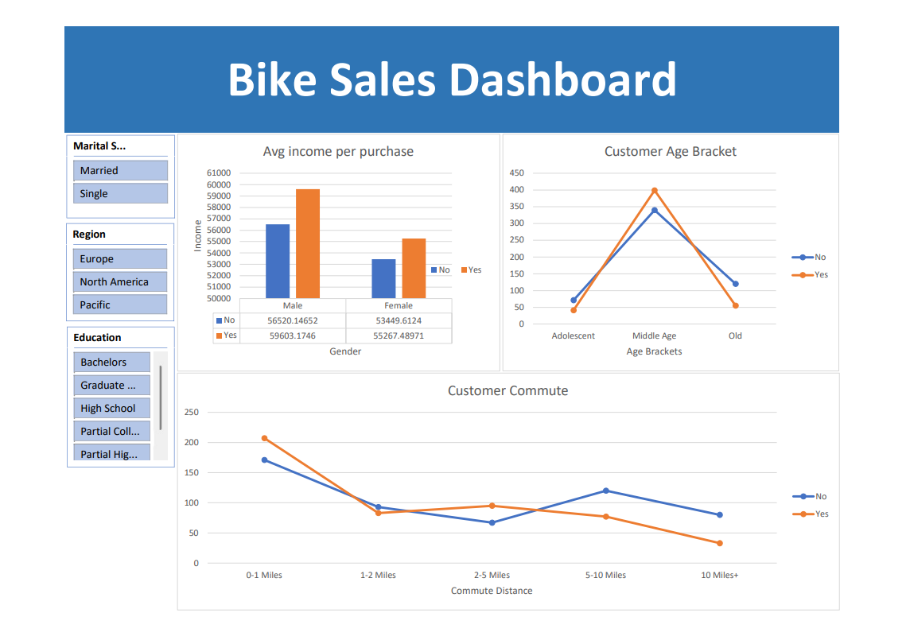

# 🚲 Bike Sales Dashboard using Microsoft Excel

## Project Overview

This project analyses customer purchasing behaviour using a Bike Sales dataset and an interactive Excel dashboard.

The objective is to identify customer characteristics that influence bike purchases and provide actionable business insights through data visualization.

## Business Problem

The company wants to understand:

- Which customer segments are most likely to purchase bikes?
- How income influences purchasing decisions.
- The impact of age and commute distance on bike sales.
- Customer demographics associated with higher conversion rates.

## Tools Used

- Microsoft Excel
- Pivot Tables
- Pivot Charts
- Slicers
- Data Cleaning Techniques
- Data Visualization

## Dataset Information

The dataset contains customer demographic and purchasing information, including:

- Gender
- Age
- Income
- Marital Status
- Education
- Occupation
- Region
- Commute Distance
- Bike Purchase Status

## Dashboard Preview

## KPIs Tracked

- Total Customers
- Total Bike Purchases
- Purchase Rate
- Average Customer Income

## Analysis Performed

### Customer Income Analysis
Examined the relationship between income levels and bike purchases.

### Age Group Analysis
Segmented customers into age brackets and analyzed buying behaviour.

### Commute Distance Analysis
Evaluated how travel distance affects purchasing decisions.

### Demographic Analysis
Studied purchasing patterns across gender, education, and marital status.

## Skills Demonstrated

- Data Cleaning
- Data Transformation
- Exploratory Data Analysis
- Dashboard Development
- Business Insight Generation
- Data Storytelling

## Repository Structure

Data/
Dashboard/
Documentation/
Images/
README.md

## Author

Harshit Kaishwar

Aspiring Data Analyst

LinkedIn: [Link]

GitHub: [Link]

